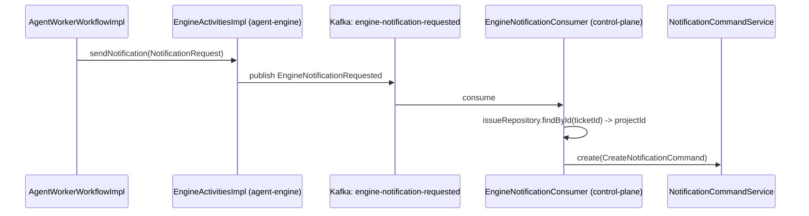

# AB-01: Engine Notification Decoupling

**Single responsibility:** Replace `EngineActivitiesImpl`'s direct calls into `IssueRepository` and
`NotificationCommandService` with a Kafka-published, `contracts`-defined message that Control Plane
consumes.

**Commit message:** `feat: decouple engine notifications via kafka`

## Why

`EngineActivitiesImpl.sendNotification` currently: looks up the `WorkflowRun` to get its `ticketId`,
loads the `Issue` by that id to read `projectId`, and calls `NotificationCommandService.create(...)`
directly. All three of those types live in packages that will move to `control-plane-app`; Agent
Engine cannot keep calling them once the apps are physically separate.

## Design

- New `contracts` message: `com.example.worker.contracts.agentworker.EngineNotificationRequested`
  — `record(workflowRunId: String, ticketId: String, type: String, severity: String, title: String,
  message: String, idempotencyKey: String, occurredAt: Instant)`. Plain record, no framework types,
  matching `WorkRequested`.
- New Kafka topic constant, colocated with the message: `"engine-notification-requested"`.
- `EngineActivitiesImpl` gains an `application.port.NotificationPublisher` port (mirrors the existing
  `WorkspaceRuntime`/`SourceControlPlugin` hexagonal style) with one method,
  `publish(EngineNotificationRequested event)`; `sendNotification` calls only this port and stops
  importing `IssueRepository`/`NotificationCommandService`/`WorkflowRun` domain internals for this
  purpose (it still needs `workflowRunRepository` to resolve `ticketId`, which stays — that repository
  is Engine's own).
- Infrastructure adapter: `KafkaNotificationPublisher implements NotificationPublisher`, backed by
  `KafkaTemplate<String, EngineNotificationRequested>` — the first real Kafka producer in this
  codebase.
- Control-plane side: `EngineNotificationConsumer` in `notification.infrastructure.kafka`,
  `@KafkaListener(topics = "engine-notification-requested")`, replicates today's lookup-then-create
  logic (`issueRepository.findById(IssueId.of(ticketId))` -> `notificationCommandService.create(...)`).
- The existing "Compatibility constructor for isolated workflow tests" on `EngineActivitiesImpl` is
  removed once the port makes `issueRepository`/`notificationCommandService`-shaped nulls unnecessary
  — tests inject a fake/mock `NotificationPublisher` instead.

## Steps (TDD)

1. **Red:** add `EngineNotificationRequestedTest` (contracts module) asserting the record's fields and
   `idempotencyKey()`-free plain shape (mirrors `WorkRequestedTest` style).
2. **Green:** add the record + topic constant to `contracts`.
3. **Red:** add/extend `EngineActivitiesImplTest` — inject a mock `NotificationPublisher`; assert
   `sendNotification` calls `publisher.publish(...)` with the expected `EngineNotificationRequested`
   and performs **no** `issueRepository`/`notificationCommandService` calls (delete those mocks from
   the test entirely once the port lands).
4. **Green:** introduce the `NotificationPublisher` port, rewire `EngineActivitiesImpl`, delete the
   `IssueRepository`/`NotificationCommandService` fields/imports and the compatibility constructor.
5. **Red:** add `KafkaNotificationPublisherTest` (or fold into an existing adapter test pattern) —
   verify it calls `kafkaTemplate.send("engine-notification-requested", key, event)`.
6. **Green:** implement `KafkaNotificationPublisher`.
7. **Red:** add `EngineNotificationConsumerTest` — given a fake `IssueRepository` returning an issue
   and a mock `NotificationCommandService`, verify the consumer builds the same
   `CreateNotificationCommand` shape the old inline code built (idempotency key format included).
8. **Green:** implement `EngineNotificationConsumer`.
9. Run `./gradlew check` — full suite green, same pre-existing unrelated failures only.
10. Update `docs/architecture/control-plane-agent-engine.md` if it documents the old direct-call path
    (check first; only touch if it does).

## Acceptance criteria

1. `EngineActivitiesImpl` no longer imports anything from `com.example.worker.issue.*` or
   `com.example.worker.notification.*`.
2. A `sendNotification` call results in the same notification being created (same `projectId`,
   `eventKey`, `type`, `severity`, `title`, `message`) as before, verified through the new consumer's
   unit test — behavior-preserving, not behavior-changing.
3. All new production code is exercised by a focused unit test written first (TDD, no test-after).
4. `./gradlew check` passes with no new failures.
