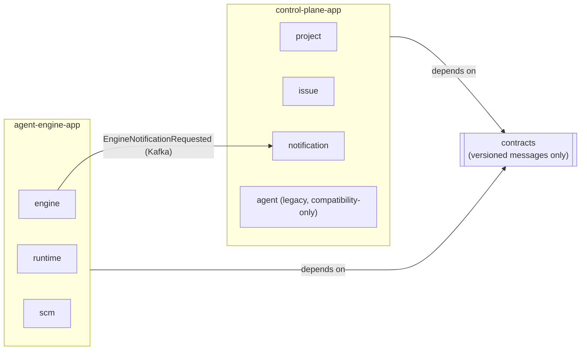

# Physical Application Boundary Master Plan (Platform Stage 2)

**Status:** Approved planning baseline
**Scope:** Split the single `worker` deployable into two independently buildable/runnable Spring Boot
applications — `control-plane-app` and `agent-engine-app` — sharing only versioned messages in
`contracts`. No new product feature is included in this document.

> **For agentic workers:** Execute one child plan at a time. Each child plan is one responsibility and
> must end in one commit.

## 1. Why now

[platform-master-plan.md](../platform-master-plan.md) Stage 2 requires deployables split into
`control-plane` and `agent-engine`, retaining only `contracts` as shared code. Control Plane core
(CP-01~CP-05) is complete and already has zero compile-time dependency on `engine`/`runtime`/`scm`.

## 2. Discovered blocker

`EngineActivitiesImpl` (agent-engine side, reference Activity implementation) directly imports and
calls `IssueRepository` and `NotificationCommandService` from the `issue`/`notification` packages
(control-plane side) to resolve an Issue's `projectId` and persist a Notification. This is an
in-process shortcut that cannot survive a physical split — once the two apps run as separate JVMs,
agent-engine can no longer reach into control-plane's repositories directly.

**Decision (confirmed with the operator):** replace this direct call with a Kafka event, following
the same versioned-message pattern already scaffolded in `contracts` (`WorkRequested`,
`ProjectExecutionSnapshot`). Agent Engine publishes an `EngineNotificationRequested` message; Control
Plane's `notification` bounded context consumes it, resolves the Issue's `projectId` itself, and
calls the existing `NotificationCommandService.create(...)`. This is the first real Kafka producer in
the codebase — no producer infrastructure exists yet (`IssueCreatedEventConsumer` currently has no
matching publisher; wiring one is out of scope here and left to a future ticket-sync adapter).

## 3. Target topology

`common` (shared exception/web helpers) is duplicated into both app modules rather than kept as a
third shared module — it is small, framework-facing, and duplicating it avoids yet another module
boundary to maintain for two trivial packages.

`agent` (the legacy local-path Claude-CLI flow) is bundled into `control-plane-app`: it depends
directly on `issue`, has no dependency on `engine`/`runtime`/`scm`, and per the platform master plan
remains "compatibility-only... not expanded." It is not migrated to the Temporal-based engine.

## 4. Database and migration ownership

A single shared PostgreSQL instance and Flyway migration history (`V1`..`V7`, unchanged) remain in
place — the master plan's Stage 2 exit bar is deployable separation and contracts-only shared code,
not per-app databases. To avoid two apps racing Flyway against the same `flyway_schema_history` table:

- `control-plane-app` owns Flyway (`spring.flyway.enabled=true`) and keeps the full migration set.
- `agent-engine-app` runs with `spring.flyway.enabled=false` and `spring.jpa.hibernate.ddl-auto=validate`
  against the already-migrated schema. It must start after control-plane-app has migrated at least
  once (true in every environment already, since both are currently one process).

This is revisited if/when the two apps are later given separate databases; not in this plan's scope.

## 5. Child-plan order

| Order | Plan | Single responsibility | Commit message |
|---:|---|---|---|
| AB-01 | [Engine notification decoupling](AB-01-engine-notification-decoupling.plan.md) | Replace Engine's direct Issue/Notification repository calls with a Kafka contract message | `feat: decouple engine notifications via kafka` |
| AB-02 | [Gradle module skeleton](AB-02-gradle-module-skeleton.plan.md) | Introduce `control-plane-app` and `agent-engine-app` Gradle subprojects | `chore: add control-plane-app and agent-engine-app modules` |
| AB-03 | [Control Plane app migration](AB-03-control-plane-app-migration.plan.md) | Move `project`/`issue`/`notification`/`agent`/`common` into `control-plane-app` | `chore: move control plane domains into control-plane-app` |
| AB-04 | [Agent Engine app migration](AB-04-agent-engine-app-migration.plan.md) | Move `engine`/`runtime`/`scm`/`common` into `agent-engine-app` | `chore: move agent engine domains into agent-engine-app` |
| AB-05 | [Boundary verification](AB-05-boundary-verification.plan.md) | Prove both apps build, boot, and pass their focused tests independently | `test: verify control-plane-app and agent-engine-app boundaries` |

## 6. Cross-plan invariants

- No class under `agent-engine-app` imports a class under `control-plane-app`, and vice versa, except
  through `contracts`.
- `contracts` gains no Spring, Temporal, JPA, or Kafka annotation dependency — only plain records and
  the topic-name constants needed to address them.
- Each child plan leaves the full build green (`./gradlew check`) before its commit.
- The existing legacy-test failures and the Docker-gated integration test (documented in
  `platform-master-plan.md` §6) are pre-existing and out of scope for this plan.

## 7. Exit criteria

1. `agent-engine-app` and `control-plane-app` each build and boot independently.
2. Neither app's source depends on the other except via `contracts`.
3. Agent Engine's reference notification path is proven end-to-end through the Kafka message, not a
   direct method call.
4. Frontend static assets and API base URLs are documented for the split (which origin serves which
   route) — resolved in AB-05, since the current frontend calls both `/api/projects/*` and
   `/api/engine/workflow-runs/*` from one origin today.
