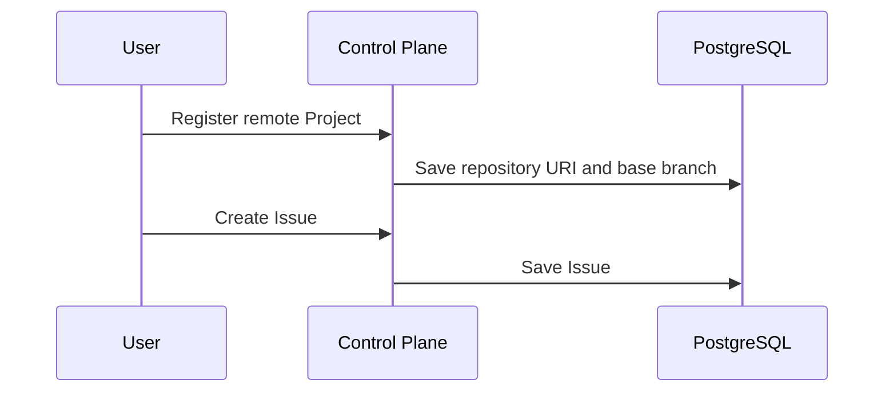

# Control Plane Master Plan

> **For agentic workers:** Execute one child plan at a time. Each child plan is one responsibility and must end in one commit.

**Goal:** Make a remote Git Project and a directly registered Issue usable without coupling the Control Plane to Temporal, an AI provider, or an external synchronization adapter.

**Architecture:** `project` and `issue` remain the Control Plane core. Their ports are defined in the application layer and implemented by JPA adapters. Agent and external-sync adapters are outside this plan; the legacy local-path `agent` route is not used by new registrations.

**Tech Stack:** Java 21, Spring Boot 3.5, Gradle, PostgreSQL/Flyway, Spring Data JPA, Kafka, JUnit 5, Mockito.

---

## Scope

### In scope

- Remote Git repository URI, base branch, optional credential reference.
- Direct Project and Issue registration.
- Transactional Project and Issue creation, retrieval, and status update.
- Focused verification of the Project-to-Issue core path.

### Out of scope

- Starting Temporal workflows or publishing work requests from Control Plane.
- AI model selection, CLI/API execution, worktree creation, QA execution, PR creation.
- External Issue ingestion (GitHub/Jira/Notion/Slack) and authentication UI.
- Repairing legacy `agent` tests unrelated to the new Control Plane path.

## Child-plan order

| Order | Plan | Single responsibility | Commit message |
|---:|---|---|---|
| CP-01 | [Remote Project domain model](CP-01-remote-project-domain.plan.md) | Express remote repository registration in the domain model | `feat: model remote git project` |
| CP-02 | [Remote Project persistence](CP-02-remote-project-persistence.plan.md) | Persist and retrieve remote Project fields safely | `feat: persist remote git project` |
| CP-03 | [Project registration API](CP-03-project-registration-api.plan.md) | Expose remote Project registration through the Control Plane API | `feat: register remote git project` |
| CP-04 | [Issue core boundary](CP-04-issue-work-request.plan.md) | Register and manage Issues without Agent/Sync dependencies | `feat: isolate issue core` |
| CP-05 | [Control Plane verification](CP-05-control-plane-verification.plan.md) | Establish an executable happy-path verification gate | `test: verify control plane work request flow` |

## Cross-plan invariants

- A repository URI is remote (`https`, `http`, or `ssh`) and never a filesystem URI.
- `credentialRef` identifies a secret managed elsewhere; it never contains a token/password and is never emitted in `WorkRequested`.
- New Project creation does not require a local checkout.
- No Control Plane Project/Issue class imports Temporal SDK types, Agent Runtime classes, or Kafka publisher ports.

## Exit criteria

1. A valid remote Project is stored and retrievable without `localPath`.
2. An Issue against that Project can be created, listed, retrieved, and status-updated without Agent/Kafka collaborators.
3. Focused Control Plane tests pass without requiring the legacy Agent tests or a live PostgreSQL process.
4. The task commits exist in CP-01 through CP-05 order.
