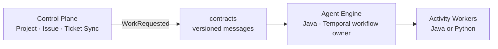
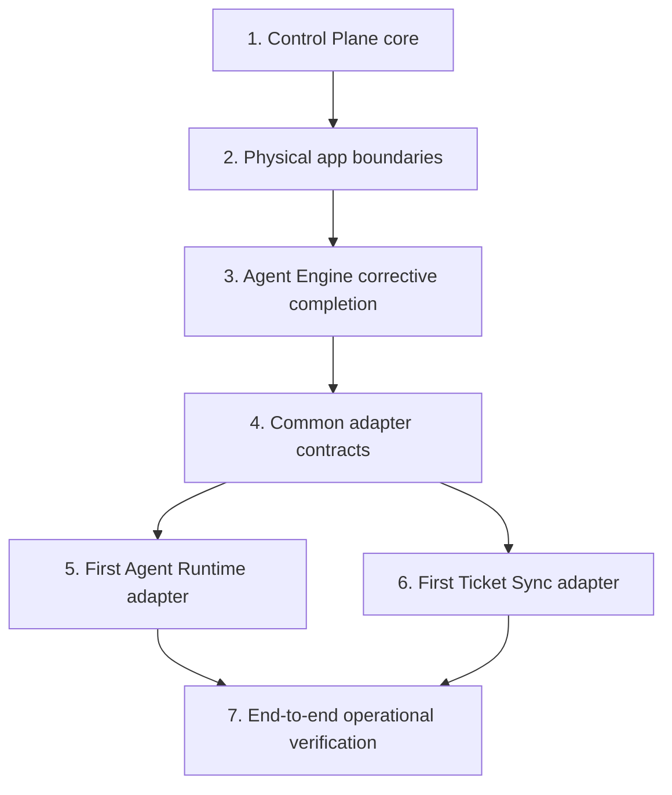

# Agentic Worker Platform Master Plan

**Status:** Approved planning baseline  
**Scope:** Core-first platform reconstruction; no feature implementation is included in this document.

## 1. Goal

Build an operable platform in which a remote Git project and an issue can start a durable Agent Engine workflow, while the Engine remains independent of AI providers and ticket-system products.

## 2. Architecture boundary

| Area | Core responsibility | Adapter responsibility | Current core / adapter progress |
|---|---|---|---:|
| Control Plane | Own Project, Issue, normalized work requests | Kafka, external ticket systems, Git credential stores | 40% / 15% |
| Agent Engine | Own Temporal state, gates, six stages, loop policy | Temporal client/worker, workspace, SCM, Activity workers | 70% / 40% |
| Plugin Integration | Define provider and ticket-sync ports and selection rules | Codex CLI/API, GitHub Issues, Jira, Notion, Slack | 10% / 15% |

The percentages are capability-weighted estimates, not code-volume measurements. The Engine test scope currently passes, but its AI assessment, planning, implementation, and QA activities are deterministic reference implementations.

## 3. Delivery order

### Stage 1 — Control Plane core

Remote Git Project registration and direct Issue registration. Agent Engine work requests and external ticket synchronization are excluded from this core target.

### Stage 2 — Physical application boundaries

Split deployables into `control-plane` and `agent-engine`; retain only versioned messages in `contracts` as their shared code.

### Stage 3 — Agent Engine corrective completion

Complete durable projections for workflow stage/status/gates, verify restart/retry behavior, and remove remaining reference-only assumptions from the Engine boundary. AI judgement remains outside the Engine.

### Stage 4 — Common adapter contracts

Define the minimal provider and ticket-sync ports, capability metadata, explicit Spring configuration selection, error model, and secret-reference rule. No dynamic plugin marketplace or classpath discovery is in scope.

### Stage 5 — First Agent Runtime adapter

Implement one Activity Worker using Codex CLI. It performs repository assessment, implementation planning, implementation, and QA through the established contracts.

### Stage 6 — First Ticket Sync adapter

Implement GitHub Issues inbound/outbound/approval synchronization. Jira, Notion, Slack, and Todo products remain later adapters.

### Stage 7 — Operational verification

Prove a direct or GitHub-created issue reaches a workflow; preserve attempt artifacts and QA reports; process approval/rejection; recover after worker failure or server restart.

## 4. Platform rules

- A task has one responsibility, one acceptance criterion set, one test scope, one review record, and one commit.
- New core code is independent of external product SDKs; I/O is an infrastructure adapter.
- `contracts` contains only versioned messages. It contains no Spring, Temporal, JPA, local-path, or secret value dependency.
- Java owns Temporal Workflow code. Java or Python may own Activity Worker implementations.
- Workflow history holds references, never a credential or large artifact body.
- Existing local-path/legacy `agent` flow is compatibility-only and is not expanded by Stage 1.

## 5. Quality gates for every task

1. Write a focused failing test for the task's behavioral rule.
2. Implement the smallest code that makes that test pass.
3. Run the task's focused test command and `git diff --check`.
4. Review the task against its acceptance criteria and architectural boundary.
5. Commit only the files belonging to that task.

## 6. Current blockers kept outside Stage 1

- Six legacy `agent` tests fail from format-string and Mockito-stubbing defects.
- `WorkerApplicationTests` requires an unavailable PostgreSQL instance.
- Existing `docs/planning/agentic-worker.plan.md` describes the obsolete local-path/Claude-only architecture. It remains historical until a dedicated documentation replacement task.

## 7. Next document

Execute the Control Plane planning set in [control-plane-master-plan.md](control-plane/control-plane-master-plan.md). No implementation task may begin until its predecessor plan is approved and its single-task commit is complete.
