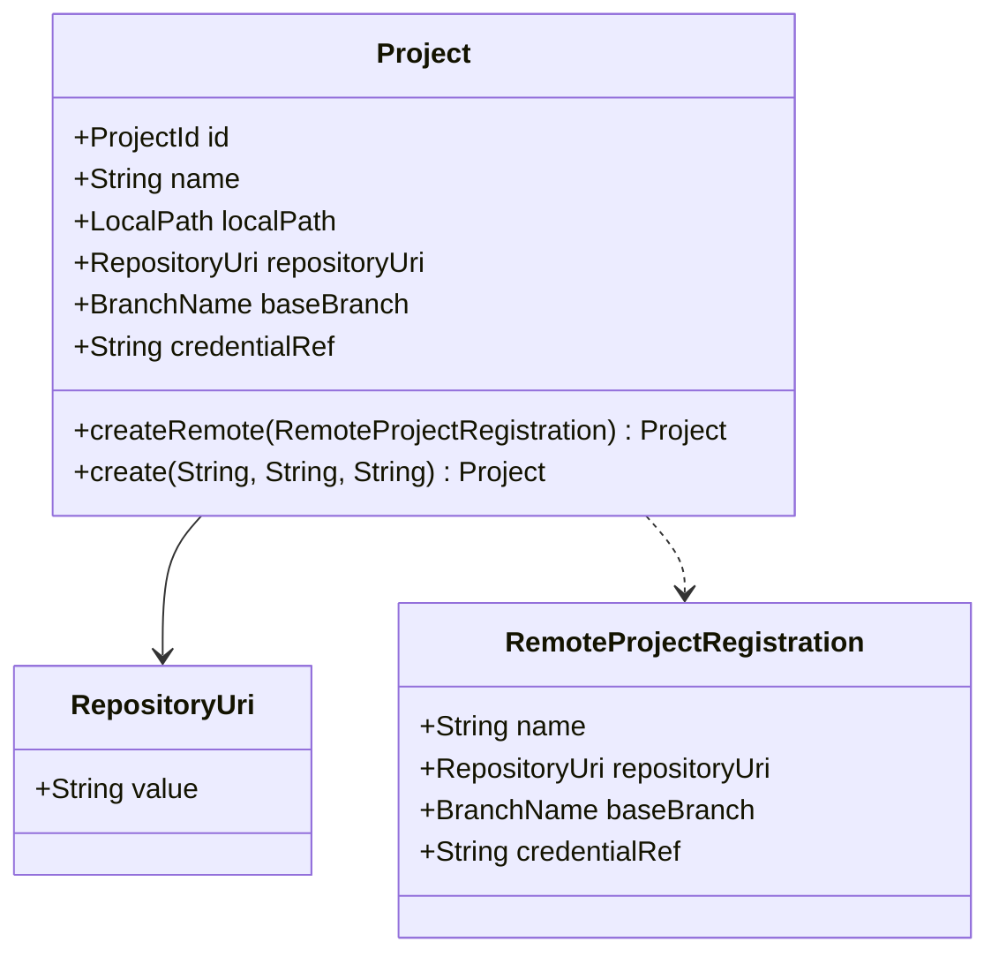

# [Design] Control Plane CP-01 — Remote Project Domain

**Plan:** `docs/01-plan/control-plane/CP-01-remote-project-domain.plan.md`
**PDCA phase:** Design
**Commit boundary:** `feat: model remote git project`

## Design decision

`Project` gains a remote creation path without removing the legacy local-path path. A remote project has a `RepositoryUri`, `BranchName`, and optional credential reference; it has no `LocalPath`.

`RemoteProjectRegistration` groups the creation inputs so the public factory does not accept ambiguous consecutive `String` parameters.

## Invariants

- Accepted URI schemes are `https`, `http`, and `ssh` only.
- `file:` URI and a URI without a scheme fail with `PROJECT_REPOSITORY_URI_INVALID`.
- `credentialRef` is an identifier only. CP-01 neither resolves it nor stores a credential value.
- `createRemote` never constructs `LocalPath`; therefore it never accesses the local filesystem.
- Legacy `create` and `reconstitute` keep their current behavior until CP-02 changes persistence.

## Implementation order (Do)

1. Add one failing SSH URI test; accept only the three remote schemes.
2. Implement scheme allow-list and run the focused URI test.
3. Add one failing `Project.createRemote` behavior test.
4. Add `RemoteProjectRegistration` and the minimum Project fields/factory to pass it.
5. Run the two focused domain tests, `git diff --check`, then review Hookify boundary rules.

## Exclusions

- No Flyway/JPA/API change.
- No credential provider, Git command, Temporal, Kafka, Agent, or ticket-sync code.
- No removal of the legacy local-path project factory.

## Verification

`./gradlew.bat :test --tests 'com.example.worker.project.domain.model.*' -x :contracts:test -x npmBuild`

Expected result: the remote URI and remote Project domain tests pass without Spring context, database, or filesystem access.
