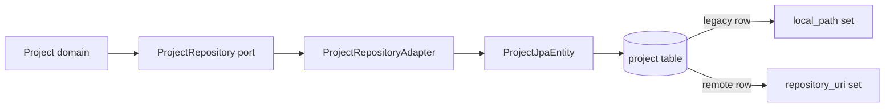

# [Design] Control Plane CP-02 — Remote Project Persistence

**Plan:** `docs/01-plan/control-plane/CP-02-remote-project-persistence.plan.md`
**PDCA phase:** Design
**Commit boundary:** `feat: persist remote git project`

## Design decision

The `project` table temporarily supports either a legacy local-path Project or a remote Project. Existing `local_path` data and unique constraint remain, but the column becomes nullable so a remote Project can have no checkout. `repository_uri` is nullable for legacy rows and unique for non-null remote rows.



## Migration

```sql
ALTER TABLE project ALTER COLUMN local_path DROP NOT NULL;
ALTER TABLE project ADD COLUMN repository_uri VARCHAR(500);
ALTER TABLE project ADD COLUMN credential_ref VARCHAR(200);
CREATE UNIQUE INDEX uq_project_repository_uri
    ON project (repository_uri)
    WHERE repository_uri IS NOT NULL;
```

No existing data is rewritten or removed.

## Mapping rules

- `ProjectJpaEntity.from(remoteProject)` writes `repository_uri`, `credential_ref`, and a null `local_path`.
- `ProjectJpaEntity.toDomain()` selects `Project.reconstituteRemote` when `repository_uri` is present; otherwise it keeps the legacy `Project.reconstitute` path.
- `ProjectRepository.existsByRepositoryUri(RepositoryUri)` delegates to a Spring Data named query.
- New mutable entity setters are not introduced. The static `from` factory initializes fields directly.

## Verification

1. Unit test an adapter round trip for a remote Project with a mocked JPA repository.
2. Unit test repository-URI duplicate lookup delegation.
3. Run focused project infrastructure tests and `git diff --check`.

## Exclusions

No API request change, no direct Issue change, no message publication, and no external credential lookup.
