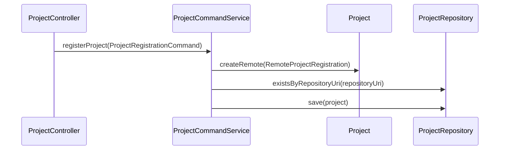

# [Design] Control Plane CP-03 — Project Registration API

**Plan:** `docs/01-plan/control-plane/CP-03-project-registration-api.plan.md`
**PDCA phase:** Design
**Commit boundary:** `feat: register remote git project`

## API contract

```json
POST /api/projects
{
  "name": "catalog",
  "repositoryUri": "https://github.com/acme/catalog.git",
  "baseBranch": "main",
  "credentialRef": "github-app/catalog"
}
```

The success response remains `201 Created` with `Location: /api/projects/{id}`. A duplicate `repositoryUri` produces `409 Conflict` with `PROJECT_REPOSITORY_URI_DUPLICATED`.

## Boundary design



- `CreateProjectRequest.toCommand()` creates one application command; the controller remains a delegator.
- `ProjectCommandService` performs URI duplicate validation, builds domain value objects, and saves the remote Project.
- `ProjectResponse`, `ProjectSummary`, and `ProjectDetail` expose `repositoryUri`, `baseBranch`, and timestamps only. They never expose credential references or local paths.
- Transactional command logging follows the existing Hookify `>>>` / `<<<` convention.

## Verification

1. A command-service test proves a remote Project is saved.
2. A duplicate-URI test proves the correct business error.
3. A response factory test proves credential reference is absent from the public response shape.
4. Focused project tests and `git diff --check` pass.

## Exclusions

No Issue creation, message publication, external credential resolution, UI migration, or legacy Agent repair.
