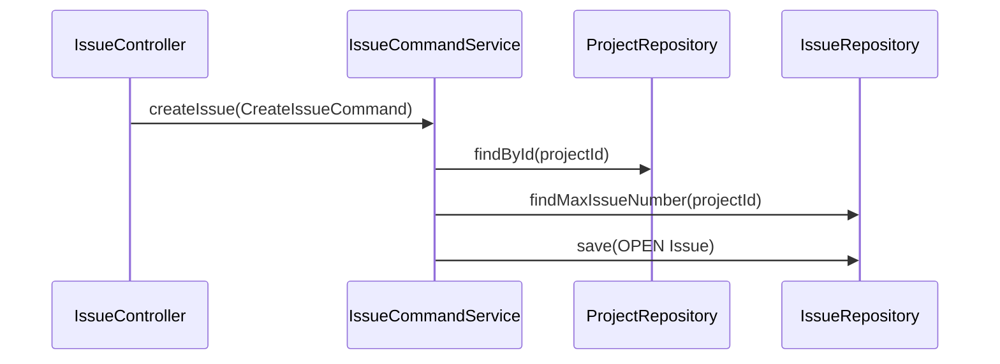

# [Design] Control Plane CP-04 — Issue Core Boundary

**Plan:** `docs/01-plan/control-plane/CP-04-issue-work-request.plan.md`
**PDCA phase:** Design
**Commit boundary:** `feat: isolate issue core`

## Design

Issue creation is a Control Plane transaction: resolve Project, allocate the next Project-local Issue number, create an `OPEN` Issue, and save it. It does not publish Kafka events, create an Agent job, or require a local checkout.

- `CreateIssueCommand` prevents ambiguous controller/service parameters.
- `IssueCommandService` only depends on Project and Issue repository ports.
- `IssueController` only depends on Issue application services; the Agent-job endpoint is removed.
- Legacy Agent event classes may remain outside the Control Plane core to avoid an unrelated Agent rewrite, but no Project/Issue core type imports them.

## Verification

- Remote Project Issue creation unit test with mocked repositories.
- Project-not-found behavior test.
- Static import scan of Issue core packages for `agent`, `kafka`, and `temporal`.

## Exclusions

No work request, outbox, Kafka publisher, Temporal start, external ticket sync, or Agent-job lookup.
