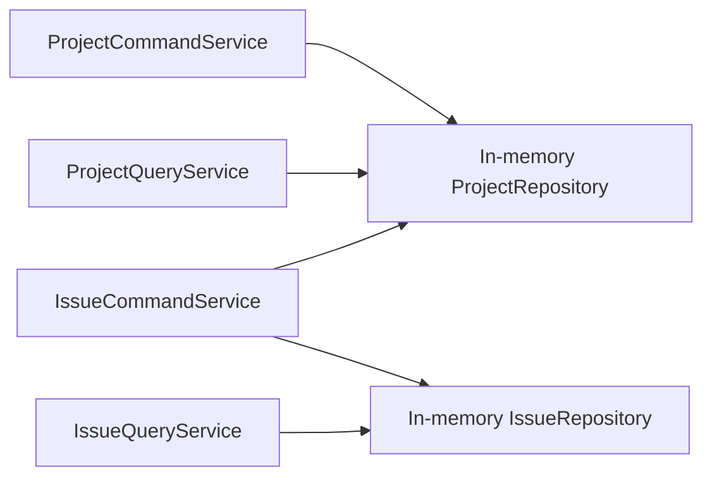

# [Design] Control Plane CP-05 — Core Use Case Verification

**Plan:** `docs/01-plan/control-plane/CP-05-control-plane-verification.plan.md`
**PDCA phase:** Design
**Commit boundary:** `test: verify control plane core use cases`

## Verification model

One application-level test wires the real Project and Issue application services to in-memory implementations of their repository ports.

The test proves this ordered use case:

1. Register remote Project with a credential reference.
2. Retrieve its public Project detail and verify the reference is absent.
3. Create an Issue under the Project.
4. List and retrieve the Issue.
5. Move the Issue from `OPEN` to `PLAN_IN_PROGRESS`.

No Spring context, JPA, Kafka, Temporal, Agent class, or external ticket sync is constructed. This keeps the verification aligned with the requested Control Plane core boundary.

## Test fixture constraints

- In-memory ports implement only existing port methods.
- The fixture preserves repository semantics required by the use case: Project URI duplicate lookup and Project-local maximum Issue number.
- The test never reads credential reference from public DTOs/responses.

## Exclusions

Database migration execution, external message delivery, Activity workers, approvals, and Agent/Sync functionality.
