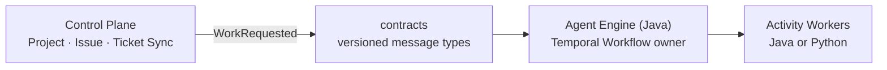

# Control Plane and Agent Engine Boundary

## Approved target

시스템은 두 실행 애플리케이션으로 분리한다.

- Control Plane은 원격 Git 프로젝트와 이슈를 소유한다.
- Agent Engine은 Java로 Temporal Workflow의 상태·승인·루프를 소유한다.
- Agent와 QA 실행은 Temporal Activity Worker로 분리하며 Java 또는 Python 구현을 허용한다.
- 두 애플리케이션은 공통 도메인 객체나 로컬 파일 경로를 공유하지 않고 `contracts`의 버전된 메시지로 연결한다.

## Implemented now

`contracts` Gradle 모듈과 `WorkRequested` 계약을 추가했다.

`WorkRequested`는 `issueId`에서 결정론적 `workflowId`를 생성한다. 같은 이슈의 중복 메시지는 동일한 Temporal Workflow ID를 사용해야 한다.

## Next implementation slices

1. Project를 원격 Git URL·기본 브랜치·인증 참조로 등록한다.
2. 이슈 등록 시 `WorkRequested`를 발행한다.
3. `control-plane`과 `agent-engine` 실행 모듈로 기존 패키지와 리소스를 물리적으로 분리한다.
4. Agent Engine이 메시지를 소비해 Java Temporal Workflow를 시작한다.
