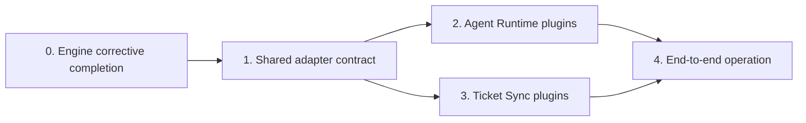

# Remaining Architecture Roadmap

> 목적: Agent Worker Engine의 6단계 뼈대를 실제 AI 실행과 외부 티켓 입력으로 연결하기 위한 설계 순서를 정의한다.

## Current position

| Area | Position | Next action |
|---|---|---|
| Agent Worker Engine | T01~T07 구현됨, 리뷰 보완 및 T08 미진행 | 검토 지적사항을 먼저 보완하고 API·통합 검증을 완료한다. |
| Agent Runtime | Activity 계약과 결정론적 스텁만 존재 | 실제 Agent/QA 실행 플러그인 설계를 만든다. |
| Ticket Sync | 미착수 | 정규화 Ticket 입·출력 플러그인 설계를 만든다. |

## Build order

### 0. Engine corrective completion

새 기능을 설계하기 전에 T01~T07 리뷰에서 확인된 실행 차단 항목을 수정한다.

- 실제 `EngineActivities` Worker 등록과 각 Activity 구현체 연결
- QA 미통과 결과가 Draft PR·병합 단계로 진행되지 않도록 제어
- Workflow 시작·단계·Attempt 이력을 영속 프로젝션에 반영
- Activity 재시도/Worker 재기동에도 유지되는 Source Control 멱등성
- 반려 시 허용된 이전 단계로만 이동하도록 전이 검증

완료 기준은 별도 수정 Task의 테스트와 재리뷰 통과다. 그 뒤 T08에서 API, 실패 재시도, Docker 기반 통합 경로를 검증한다.

### 1. Shared adapter contract

Agent Runtime과 Ticket Sync가 같은 방식으로 교체될 수 있는 최소 경계만 정의한다. 별도 플러그인 관리 서버나 범용 런타임은 만들지 않는다.

- 버전된 JSON DTO, `ArtifactRef`, 멱등 키, 오류 코드
- Task Queue와 구현체 배포 단위의 매핑
- 구현체 선택 설정: 프로젝트 기본값 + Ticket별 오버라이드
- 구현체 식별자, 지원 capability, 설정 검증 규칙
- Secret은 설정 참조만 전달하고 DTO·Temporal History에 넣지 않는 규칙

산출물: `docs/specs/adapter-contract.md`, 계약 테스트, Java/Python/TypeScript 예시 한 개씩이 아닌 **하나의 대표 외부 Worker 예시**.

### 2. Agent Runtime plugins

엔진이 AI 모델이나 호출 방식(API/CLI)을 알지 않게 하고, 다음 포트를 실행 구현체로 교체한다.

| Port | Required responsibility | First implementation |
|---|---|---|
| `TicketAssessment` | 저장소 기반 적합성·공수·정제 기획 | 선택한 Agent provider |
| `ImplementationPlanning` | 성공 기준·테스트 방법을 포함한 계획 생성 | 같은 provider |
| `ImplementationExecution` | `WorkspaceRef` 안에서 변경·산출물 생성 | CLI worker 또는 API worker |
| `QualityAssurance` | 테스트·정적 검사·점수·QA 보고서 생성 | 로컬 QA worker |
| `Notification` | 승인 대기·실패·완료 전달 | Ticket Sync outbound 구현체 |

전략 선택은 `provider + transport` 조합으로 제한한다. 예: `codex-cli`, `openai-api`, `claude-cli`. 모델명, timeout, 허용 도구, QA 기준은 구현체 설정으로 둔다. Engine의 Workflow 코드는 수정하지 않는다.

산출물: Agent Runtime 상세 스펙, 포트별 DTO, 첫 번째 provider 구현체 및 계약·통합 테스트.

### 3. Ticket Sync plugins

Ticket Sync는 외부 시스템별 모델을 Engine에 노출하지 않고 정규화 Ticket과 상태·산출물 링크만 교환한다.

| Direction | Required responsibility |
|---|---|
| Inbound | webhook/polling 입력을 검증하고 중복 없이 Ticket으로 정규화 |
| Outbound | 단계, 승인 대기, 실패, QA, PR 링크를 원본 티켓에 반영 |
| Approval | 외부 시스템의 승인·반려·수정 요청을 Engine Signal로 변환 |

첫 구현체는 하나만 선택한다. GitHub Issues를 선택하면 Issue, PR, comment를 한 API 경계에서 검증할 수 있어 가장 작은 출발점이다. Jira/Notion/Slack은 동일 계약의 후속 구현체로 둔다.

산출물: Ticket Sync 상세 스펙, 정규화 모델, 선택한 첫 Adapter, webhook 중복·서명·재전송 테스트.

### 4. End-to-end operation

두 플러그인 계열이 준비된 다음에만 운영 흐름을 확정한다.

- 직접 등록과 첫 외부 Ticket 입력이 동일한 Workflow Run을 시작하는지 검증
- 각 Attempt의 구현 산출물·QA 보고서가 Ticket과 API에서 조회되는지 검증
- 승인/반려, Worker 실패 후 수동 재시도, 서버 재시작 복구 검증
- 최소 운영 관측성: Workflow Run ID, Ticket ID, plugin ID, stage, attempt를 구조화 로그와 조회 API에 노출

## Decisions needed before detailed design

| Decision | Recommended default | Reason |
|---|---|---|
| First Agent provider | Codex CLI worker | 기존 프로젝트의 Codex 실행 흐름을 가장 적게 바꾼다. |
| First Ticket Sync | GitHub Issues | PR 연동까지 하나의 SCM 경계에서 검증할 수 있다. |
| Artifact storage | 현재 DB/파일 저장 위치를 조사 후 최소 선택 | 대용량 로그·diff를 Temporal History에 넣지 않아야 한다. |
| Adapter discovery | Spring 설정 기반 명시 선택 | 동적 JAR 탐색은 현재 요구에 비해 복잡도가 크다. |

## Document sequence

1. `docs/specs/engine-corrective-completion.md` — T01~T07 리뷰 보완 범위와 T08 진입 조건
2. `docs/specs/adapter-contract.md` — Agent/Ticket 공통 경계
3. `docs/specs/agent-runtime.md` — 모델·CLI/API 전략과 첫 구현체
4. `docs/specs/ticket-sync.md` — Inbound/Outbound/Approval 전략과 첫 구현체
5. 각 스펙의 Task 문서 — 성공 기준, 테스트 방법, 코드 품질 검사, Task 완료 후 리뷰

## Out of scope for now

- 범용 플러그인 마켓플레이스, 런타임 설치/업데이트 시스템
- 모든 티켓 시스템 동시 지원
- 모델 제공자별 별도 추상화 계층을 미리 만드는 일

첫 Agent provider와 첫 Ticket Sync Adapter가 운영 검증을 통과한 뒤에만 두 번째 구현체를 추가한다.
