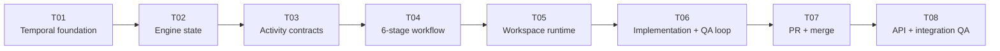

# Agent Worker Engine Task Flow

```mermaid
flowchart LR
    T1["T01\nTemporal foundation"] --> T2["T02\nEngine state"]
    T2 --> T3["T03\nActivity contracts"]
    T3 --> T4["T04\n6-stage workflow"]
    T4 --> T5["T05\nWorkspace runtime"]
    T5 --> T6["T06\nImplementation + QA loop"]
    T6 --> T7["T07\nPR + merge"]
    T7 --> T8["T08\nAPI + integration QA"]
```
