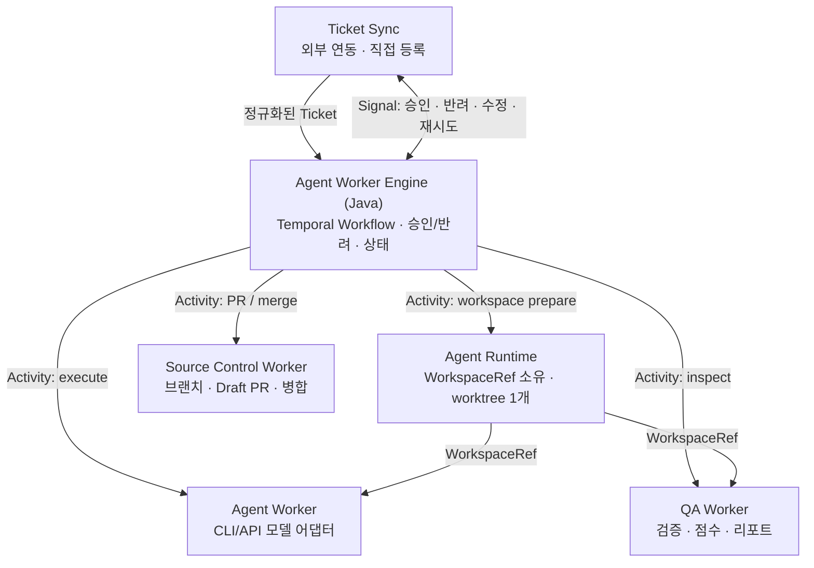

# Agent Worker System Diagram

```mermaid
flowchart TB
    Ticket["Ticket Sync\n외부 연동 · 직접 등록"]
    Engine["Agent Worker Engine (Java)\nTemporal Workflow · 승인/반려 · 상태"]
    Runtime["Agent Runtime\nWorkspaceRef 소유 · worktree 1개"]
    Agent["Agent Worker\nCLI/API 모델 어댑터"]
    QA["QA Worker\n검증 · 점수 · 리포트"]
    SCM["Source Control Worker\n브랜치 · Draft PR · 병합"]

    Ticket -->|"정규화된 Ticket"| Engine
    Engine -->|"Activity: workspace prepare"| Runtime
    Engine -->|"Activity: execute"| Agent
    Engine -->|"Activity: inspect"| QA
    Engine -->|"Activity: PR / merge"| SCM
    Runtime -->|"WorkspaceRef"| Agent
    Runtime -->|"WorkspaceRef"| QA
    Engine <-->|"Signal: 승인 · 반려 · 수정 · 재시도"| Ticket
```
