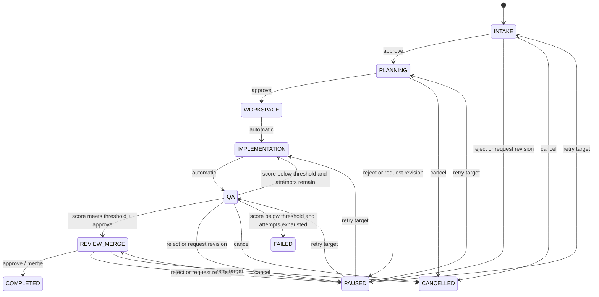

# SDD: 운영 워크플로 콘솔

> 상태: Proposed — 기존 Agent Worker Engine API를 소비하는 운영 화면 기능명세
>
> 기준 문서: [Agent Worker Engine Specification](agent-worker-engine.md)

## 1. 문제와 목표

운영자는 티켓별 자동 개발이 어느 단계에 있고, 사람의 결정이 필요한지, QA 재시도가 왜 발생했는지를 한 화면에서 판단할 수 있어야 한다.

이 기능은 다음을 제공한다.

- Workflow Run 목록에서 현재 단계, 실행 상태, 승인 대기 여부, 최신 QA 결과를 비교한다.
- Run 상세에서 6단계 진행, Attempt 이력, 산출물 참조를 확인한다.
- 허용된 단계에서 승인·반려·수정 요청·재시도·취소 결정을 보낸다.

코드 변경, Agent 실행, PR 본문 렌더링, 사용자·권한 관리 화면은 범위가 아니다.

## 2. 사용자와 핵심 흐름

| 사용자 | 목적 | 허용 액션 |
|---|---|---|
| 운영자 | 진행 상태를 모니터링하고 사람 게이트를 처리한다. | Run 조회, Attempt 조회, 승인, 반려, 수정 요청, 재시도, 취소 |

1. 운영자는 목록에서 `PAUSED` 또는 승인 대기 Run을 찾는다.
2. Run 상세에서 현재 단계, QA 점수와 Attempt 이력을 확인한다.
3. 현재 게이트가 `INTAKE`, `PLANNING`, `QA`, `REVIEW_MERGE`이면 승인 또는 수정 결정을 보낸다.
4. 반려·수정 요청 후 상태가 `PAUSED`가 되면, 운영자는 `RETRY`로 지정된 단계부터 재개한다.
5. QA 점수가 기준 미달이고 재시도 횟수가 남으면, 엔진은 사람 개입 없이 `IMPLEMENTATION`으로 되돌아간다. 시도가 소진되면 Run은 `FAILED`로 종료되며 승인으로 우회할 수 없다.

## 3. 프로세스와 상태 전이

| 단계 | 처리 방식 | 운영자 결정 |
|---|---|---|
| `INTAKE` | 기획 정제 후 게이트 대기 | 승인, 반려(현재 또는 이전 단계 지정), 수정 요청, 취소 |
| `PLANNING` | 구현계획 생성 후 게이트 대기 | 승인, 반려, 수정 요청, 취소 |
| `WORKSPACE` | 브랜치·worktree 자동 확보 | 조회만 가능 |
| `IMPLEMENTATION` | 구현 자동 실행 | 조회만 가능 |
| `QA` | QA 실행; 기준 미달 시 남은 횟수만큼 자동 재시도 | 기준 통과 뒤 승인, 반려, 수정 요청, 취소 |
| `REVIEW_MERGE` | Draft PR 생성 후 게이트 대기 | 승인(병합), 반려, 수정 요청, 취소 |

`REJECT`는 현재 단계 또는 이미 지난 단계만 대상으로 할 수 있다. `REQUEST_REVISION`은 사유가 필수이며 현재 단계로 되돌린다. `RETRY`는 `PAUSED` 상태에서만 사용한다.

## 4. 화면 명세

### 4.1 워크플로 Run 목록

목적은 운영자가 조치할 Run과 실패 Run을 먼저 찾는 것이다.

| 표시 데이터 | 설명 | 확보 상태 |
|---|---|---|
| Ticket 식별자·제목 | 어떤 티켓의 Run인지 식별 | **신규 조회 계약 필요** |
| Workflow Run ID | 실행 식별자 | 현재 단건 응답 제공 |
| 현재 단계 | `INTAKE`~`REVIEW_MERGE` | 현재 단건 응답 제공 |
| 실행 상태 | `RUNNING`, `PAUSED`, `COMPLETED`, `FAILED`, `CANCELLED` | 현재 단건 응답 제공 |
| 조치 필요 | 게이트 대기 또는 `PAUSED` 여부 | 현재 단계·상태로 계산 |
| 최신 QA 점수·Attempt 번호 | 최신 검증 결과 | Attempt 응답으로 계산 |

사용자 액션은 상태·단계 필터, Run 상세 열기다. 기본 정렬과 기간 필터는 **TBD**이며, 백엔드 목록 조회의 정렬 기준과 함께 확정한다.

### 4.2 워크플로 Run 상세

| 영역 | 표시 데이터 | 사용자 액션 |
|---|---|---|
| 요약 | Run ID, 현재 단계, 실행 상태, Ticket 정보 | 목록으로 돌아가기 |
| 단계 타임라인 | 6단계, 현재 위치, 자동/승인 게이트 구분 | 단계 상태 확인 |
| Attempt 이력 | Attempt 번호, QA 점수, 상태, 생성·완료 시각, 구현 산출물·QA 리포트 참조 | 참조 열기 |
| 결정 패널 | 현재 단계에서 가능한 결정과 입력 사유 | 승인, 반려, 수정 요청, 재시도, 취소 |

결정 패널은 유효하지 않은 액션을 숨기거나 비활성화해야 한다. 반려는 대상 단계 선택을 요구하고, 수정 요청은 빈 사유로 제출할 수 없다.

## 5. 데이터와 인터페이스

현재 제공되는 API 계약은 다음과 같다.

| API | 화면 사용처 | 데이터 또는 액션 |
|---|---|---|
| `GET /api/engine/workflow-runs/{workflowRunId}` | 상세 요약·타임라인 | `workflowRunId`, `currentStage`, `status` |
| `GET /api/engine/workflow-runs/{workflowRunId}/attempts` | Attempt 이력 | 번호, 산출물·QA 보고서 참조, 점수, 상태, 시각 |
| `POST /api/engine/workflow-runs/{workflowRunId}/decisions` | 결정 패널 | `APPROVE`, `REJECT`, `REQUEST_REVISION`, `RETRY`, `CANCEL` |

목록 화면에는 다음의 신규 읽기 계약이 필요하다. 현재 Controller에는 Run 목록·Ticket 메타데이터 조회가 없다.

| 필요한 데이터 | 이유 | 결정 필요 |
|---|---|---|
| Run 목록과 Ticket ID | 티켓별 진행 상황을 나열 | 조회 모델 또는 Ticket Sync 제공자 |
| Ticket 제목·프로젝트·우선순위 | 운영자가 식별·정렬 | Ticket Sync 제공자 |
| 게이트 대기 여부·반려 사유·대상 단계 | 조치 필요성을 정확히 표시 | Workflow query 또는 영속 조회 모델 |
| Intake·Planning 산출물 참조와 Draft PR URL | 상세 근거 표시 | Artifact/Source-control 조회 계약 |

## 6. Acceptance Criteria

1. 운영자는 목록에서 Ticket 식별자, Run ID, 현재 단계, 상태, 최신 QA 점수와 Attempt 번호를 확인할 수 있다.
2. 운영자는 상세에서 6단계 타임라인과 현재 단계를 확인할 수 있다.
3. 상세는 모든 Attempt의 번호, QA 점수, 상태, 생성·완료 시각, 구현 산출물 및 QA 보고서 참조를 표시한다.
4. `INTAKE`, `PLANNING`, 기준을 통과한 `QA`, `REVIEW_MERGE`에서만 승인 액션을 제공한다.
5. 반려 제출은 대상 단계가 없으면 차단하고, 수정 요청 제출은 사유가 비어 있으면 차단한다.
6. `PAUSED`가 아닌 Run에서는 재시도 액션을 제공하지 않는다.
7. QA 점수가 기준 미달이고 시도가 남으면 화면은 재시도 진행을 표시하며, 시도 소진으로 `FAILED`인 Run에는 승인 액션을 제공하지 않는다.
8. 결정 요청 성공 후 화면은 최신 Run 상태와 Attempt 이력을 다시 조회한다.

## 7. Open Questions

- 목록 조회의 소유자는 Engine read model인지 Ticket Sync인지 결정이 필요하다.
- Ticket 제목·프로젝트·우선순위의 원본과 권한 정책은 TBD다.
- 현재 Workflow query는 게이트 이력·대기 여부·반려 사유를 노출하지 않는다. 상세 화면에 필요한 조회 계약을 확정해야 한다.
- 산출물 참조와 Draft PR URL의 열람 방식(직접 링크 또는 Artifact API)은 TBD다.

## Related Docs

- [Agent Worker Engine Specification](agent-worker-engine.md)
- [Agent Worker Engine API integration design](../02-design/features/agent-worker-engine-t08.design.md)
- [Engine final report](../04-report/agent-worker-engine-final.report.md)
