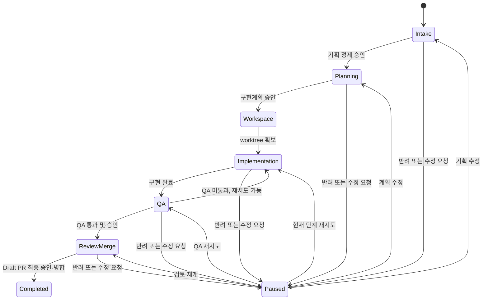

# Agent Worker Engine Specification (Proposed)

> Status: approved target design; not yet implemented.

## Purpose

Agent Worker Engine은 정규화된 티켓을 사람이 통제 가능한 개발 워크플로로 실행한다. 엔진은 구현 언어와 모델 공급자에 종속되지 않으며, Temporal Workflow와 Activity 계약으로 실행 구현체를 교체할 수 있다.

## Scope

- 6단계 개발 워크플로와 단계별 승인/반려/수정
- worktree 단일 소유권과 재사용
- 구현·QA 점수 기반 루프
- Draft PR 생성과 사용자 최종 승인 뒤 병합
- Temporal 기반 재시작 복구 및 실패 단계 수동 재시도

외부 티켓 시스템의 실제 API 구현과 특정 AI 모델 구현은 별도 Agent Adapter 및 Ticket Sync 스펙에서 다룬다.

## Core Terms

| Term | Definition |
|---|---|
| Ticket | 직접 등록 또는 외부 연동에서 들어와 정규화된 작업 요청 |
| Workflow Run | 하나의 Ticket을 처리하는 Temporal Workflow 실행. 하나의 `WorkspaceRef`를 소유한다. |
| WorkspaceRef | Runtime이 소유한 worktree를 식별하는 불투명 참조. 로컬 경로를 엔진에 노출하지 않는다. |
| Change Type | `FEATURE`, `ENHANCEMENT`, `HOTFIX` 중 하나. 브랜치 접두사를 결정한다. |
| Stage Gate | 단계 완료 뒤 진행을 막고 승인·반려·수정을 받는 제어점 |
| Attempt | 구현과 QA 루프의 한 번의 실행 단위. 산출물과 QA 보고서를 변경 불가능한 이력으로 보관한다. |

## Workflow

| Stage | Purpose | Default gate | Result |
|---|---|---|---|
| 1. Intake | raw 기획의 적합성, 예상 공수, 가능 여부를 판단하고 정제된 기획을 만든다. | 승인 필요 | Refined specification, change type recommendation |
| 2. Planning | 구현계획, 스펙, 성공 기준, 테스트 방법을 만든다. | 승인 필요 | Implementation plan |
| 3. Workspace | 브랜치와 전용 worktree를 한 번만 확보한다. | 자동 | WorkspaceRef, branch name |
| 4. Implementation | 구현계획에 따라 코드를 변경하고 산출물을 만든다. | 자동 | Change set, implementation report |
| 5. QA | 산출물과 성공 기준을 검증하고 점수·리포트를 만든다. | 승인 필요 | QA report, match rate |
| 6. Review and Merge | Draft PR을 검토하고, 최종 승인 뒤 병합한다. | 승인 필요 | Merge result |

## Branch Policy

Change Type은 Ticket에 명시된 값이 있으면 우선한다. 없으면 Intake 단계가 추천하고, Planning 승인 전 사용자가 수정할 수 있다.

| Change Type | Prefix |
|---|---|
| `FEATURE` | `feature/` |
| `ENHANCEMENT` | `enhance/` |
| `HOTFIX` | `hotfix/` |

브랜치 이름은 `{prefix}{feature-specification}_{yymmdd}`다. feature specification은 Git ref 제약에 맞게 slug로 정규화한다. `Workflow Run`은 Stage 3에서 단 하나의 worktree만 생성하며, 구현·QA 재시도와 반려 후 수정은 그 worktree를 재사용한다. 병합, 취소, 최종 실패 뒤에만 Runtime이 정리한다.

## Approval and Retry Policy

- 기본 게이트: Intake, Planning, QA, Review and Merge는 승인 필요; Workspace와 Implementation은 자동 진행이다.
- 각 게이트에서 승인, 반려, 수정 요청을 할 수 있다.
- 반려 또는 수정 요청은 이유와 수정 지시를 이력으로 보관하고 해당 단계 또는 이전 단계로 되돌린다.
- QA는 기본 `matchRate >= 90`을 통과 기준으로 사용한다. 점수는 프로젝트 또는 Ticket 정책에서 조정할 수 있다.
- Implementation → QA 루프의 총 시도 횟수는 기본 2회이며, 최대 10회까지 설정할 수 있다. Attempt는 최초 구현과 QA를 포함한 한 번의 전체 루프다.
- 프로젝트 정책이 기본값을 설정하고, Ticket 정책이 `maxAttempts(1..10)`와 `minimumQaScore`를 오버라이드할 수 있다.

## Attempt History and Artifacts

모든 Attempt는 완료·실패 여부와 관계없이 별도 이력으로 저장한다. 이력은 수정하거나 덮어쓰지 않으며, 재시도는 새 Attempt를 추가한다.

| Field | Description |
|---|---|
| attemptNumber | Workflow Run 안에서 1부터 증가하는 시도 번호 |
| implementationArtifactRefs | 변경 요약, commit SHA, 실행 로그, 생성 문서 등 구현 산출물 참조 |
| qaReportRef | 성공 기준별 결과, matchRate, 실패 사유, 재작업 지시를 담은 QA 보고서 참조 |
| qaScore | 해당 Attempt의 점수 |
| status | `PASSED`, `FAILED`, `ERROR`, `CANCELLED` |
| createdAt / finishedAt | 실행 시각 |

대용량 코드 diff, CLI 로그, QA 원문은 Temporal History에 넣지 않고 Artifact Store의 참조만 기록한다. UI와 Ticket Sync는 Workflow Run과 Attempt History를 조회해 각 루프의 산출물과 QA 보고서를 보여준다.

## Temporal Responsibilities

`AgentWorkerWorkflow`는 상태 전이, Activity 호출 순서, Signal 처리만 수행한다. Workflow 내부에서는 파일 I/O, Git/CLI/API 호출, DB 조회, 현재 시각과 난수 생성 같은 비결정적 동작을 금지한다.

| Contract | Responsibility |
|---|---|
| `TicketAssessmentActivity` | 기획 적합성·공수·change type을 평가하고 정제된 기획을 저장한다. |
| `PlanningActivity` | 구현계획과 성공·테스트 기준을 생성·저장한다. |
| `WorkspaceActivity` | 브랜치/worktree를 확보하고 WorkspaceRef를 반환한다. |
| `ImplementationActivity` | Agent Adapter로 구현을 실행하고 구현 산출물 참조를 반환한다. |
| `QualityAssuranceActivity` | QA를 실행하고 점수와 QA 보고서 참조를 반환한다. |
| `AttemptHistoryActivity` | Attempt의 산출물·QA 결과·상태를 불변 이력으로 저장한다. |
| `SourceControlActivity` | Draft PR 생성, 상태 조회, 승인된 병합을 실행한다. |
| `NotificationActivity` | 승인 대기·실패·완료를 Ticket Sync 또는 알림 구현체에 전달한다. |

Activity는 `workflowRunId + stage + attempt` 멱등 키를 사용해야 한다. Agent Runtime이 worktree를 소유하며, 각 구현체는 WorkspaceRef로 그 Runtime에 작업을 요청한다.

Temporal Signal은 `approve`, `reject`, `requestRevision`, `retryStage`, `cancel`을 제공한다. 서버나 Worker가 재시작되면 Temporal History로 Workflow가 복구된다. Activity 실패는 실패 원인과 단계 정보를 기록하고 사용자에게 알린다. 자동 CLI 재실행은 하지 않으며 사용자가 현재 단계 재시도 또는 수정 후 재시작을 선택한다.

## Agent and Plugin Boundary

Engine은 `agent-execution`, `quality-assurance`, `source-control`, `ticket-sync` Task Queue에 이름과 DTO 계약으로 요청한다. 각 Queue의 Worker는 Java, Python, TypeScript 등 독립적인 언어로 구현·배포할 수 있다.

DTO는 버전 필드를 포함하며, Workflow History에는 큰 프롬프트·로그·리포트 원문 대신 ArtifactRef만 저장한다. 구체적인 모델, CLI, API 키, SDK는 Agent Adapter 구현체의 내부 책임이다.

## Acceptance Criteria

1. Ticket 하나가 정확히 하나의 Workflow Run과 하나의 WorkspaceRef를 생성한다.
2. 같은 Run의 구현·QA 재시도는 새 worktree나 브랜치를 생성하지 않는다.
3. 승인 없이 기본 게이트 단계를 통과할 수 없다.
4. QA 점수가 설정된 기준 미만이면 설정된 총 시도 횟수(기본 2, 최대 10)까지 Implementation 단계로 돌아간다.
5. 기준을 충족한 결과만 Draft PR을 만들 수 있고, 최종 승인 없이는 병합할 수 없다.
6. Temporal Worker 또는 서버 재시작 후 Workflow는 마지막 기록 단계에서 지속된다.
7. Activity 실패는 원인·단계·시도를 기록하며 사용자 재시도 기능을 제공한다.
8. 모든 Attempt는 구현 산출물 참조와 QA 보고서 참조를 보존하며 이후 Attempt가 이를 덮어쓰지 않는다.
