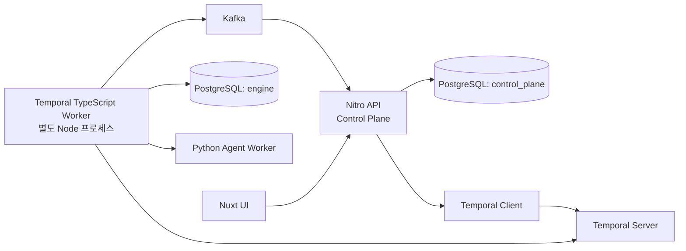

# Nuxt Control Plane · Temporal TypeScript 마이그레이션 계획

> 상태: 제안  
> 목표: Java/Spring 애플리케이션을 제거하고 Nuxt/Nitro와 Temporal TypeScript SDK로 Control Plane·오케스트레이션을 재구축한다.

## 목표 구조

- Nuxt/Nitro가 Project, Issue, Document, Notification, Webhook, Authentication API와 화면을 소유한다.
- Temporal TypeScript Worker는 Nuxt 저장소 안의 별도 실행 명령으로 배포한다. Nitro HTTP 서버의 request handler나 plugin 안에서 Worker를 실행하지 않는다.
- Python은 Agent/QA 실행 Worker만 담당한다. Temporal Workflow의 상태·승인·반려·재시도는 TypeScript Worker가 소유한다.
- PostgreSQL은 `control_plane`과 `engine` 스키마로 분리하고, 각각 Drizzle과 Temporal Worker만 쓰기 권한을 가진다. 서비스 간 상태 동기화는 DB 직접 접근이 아니라 Temporal 명령과 Kafka 이벤트를 사용한다.

## 고정 모델과 계약

### Control Plane (Nuxt + Drizzle)

| 모델 | 책임 |
|---|---|
| `projects` | 저장소 URI, 기준 브랜치, 연결 상태 |
| `issues` | 프로젝트별 번호, 제목·설명·우선순위, UI 표시 상태 |
| `documents` | Project/Issue 범위의 문서 종류와 현재 revision |
| `document_revisions` | Markdown 지침·프롬프트·계획·구현계획·QA 리포트의 불변 버전, 작성자, 승인 상태 |
| `document_artifacts` | diff·로그·대용량 리포트의 object-storage 참조 |
| `notifications` | idempotency key, 읽음 상태, severity, Issue/Workflow 연결 |
| `users`, `memberships`, `sessions` | 이후 인증과 프로젝트 역할 |
| `outbox_events` | DB 변경과 Engine/Kafka 명령을 원자적으로 연결 |

`documents.kind`는 최소 `PROMPT_TEMPLATE`, `DEVELOPMENT_GUIDE`, `QA_GUIDE`, `PLAN`, `IMPLEMENTATION_PLAN`, `DEVELOPMENT_RESULT`, `QA_REPORT`를 지원한다. 재사용 지침은 Project 범위로, 이슈별 산출물은 Issue 범위로 저장한다. 수정은 본문 덮어쓰기가 아니라 새 `document_revisions`를 추가한다.

### Engine (Temporal TypeScript)

- 기존 6단계 workflow, Signal(`approve`, `reject`, `requestRevision`, `retryStage`, `cancel`), Query, 동일 재시도 idempotency key와 stage execution generation 규칙을 TypeScript로 보존한다.
- `engine.workflow_runs`, `engine.stage_gates`, `engine.attempt_records`는 Workflow의 durable projection만 보관한다. Project/Issue/Document 테이블을 조회하거나 갱신하지 않는다.
- 기존 `WorkRequested`, `ProjectExecutionSnapshot`, `EngineNotificationRequested`는 JSON Schema 또는 TypeScript/Zod 계약으로 재정의한다. Java record를 런타임 공유 모델로 유지하지 않는다.

## Agent Worker 게이트웨이와 세션 어피니티

- Temporal TypeScript Worker는 Agent/QA 실행을 Python Worker에 직접 연결하지 않고, 별도의 **Worker
  Gateway** 컴포넌트를 통해서만 위임한다. Gateway는 워커 registry/health, 요청 라우팅, 세션 어피니티
  매핑을 책임진다.
- **세션 어피니티가 필요한 이유:** 일부 Agent 실행 세션(대화형 CLI 세션, 워커 로컬 워크스페이스 상태를
  유지하는 세션)은 같은 Workflow Run 안의 여러 Activity 호출이 반드시 동일한 워커 프로세스/세션에서
  처리되어야 한다 — 세션 컨텍스트와 워크스페이스가 그 워커에 로컬로 남아있기 때문에, 무작위/라운드로빈
  분배는 세션 연속성을 깨뜨린다.
- **라우팅 규칙:** Gateway는 `workflowRunId`(필요 시 `ticketId`) → 워커 세션 ID 매핑을 유지하는
  sticky routing을 수행한다. 최초 요청 시 워커 풀에서 하나를 선택해 세션을 배정하고 매핑에 기록하며,
  이후 같은 `workflowRunId`의 모든 요청은 그 세션으로만 라우팅된다.
- **계약 경계:** Temporal Activity는 Gateway API만 호출한다(개별 워커에 직접 연결하지 않음). Gateway
  요청/응답 스키마는 `packages/contracts`에 정의한다.
- **미정 사항 (구현 전 결정 필요):** 어피니티가 걸린 워커가 응답 불가/재시작된 경우의 정책 — 같은
  세션이 복구될 때까지 재시도할지, 워크스페이스를 다시 만들어 새 세션으로 재배정할지는 아직 정해지지
  않았다. 이 정책은 Stage 5/6 설계 시 별도로 확정한다.

## 단계별 실행

| 순서 | 작업 | 완료 기준 | 검증 |
|---:|---|---|---|
| 1 | Nuxt monorepo와 Node 런타임 구성 | `apps/control-plane`(Nuxt), `apps/temporal-worker`, `packages/contracts`가 독립 실행 | typecheck, lint, Worker smoke test |
| 2 | Drizzle schema·migration baseline | 기존 Flyway V1~V7을 분석해 `control_plane`/`engine` SQL baseline 생성; production에서는 `generate` 후 `migrate`만 사용 | 빈 PostgreSQL에 schema 생성, 기존 개발 DB 백업·복원 검증 |
| 3 | Control Plane 모델/API | Project·Issue CRUD, 문서 revision/승인, notification read/replay, outbox를 Nitro API로 구현 | Vitest API + PostgreSQL 통합 테스트 |
| 4 | 인증·권한 기반 | 세션 쿠키, 사용자·프로젝트 membership, 모든 API의 server-side 권한 검사 | 무인증 401, 타 프로젝트 403, 역할별 승인 테스트 |
| 5 | Temporal TypeScript 이식 | Java Workflow/Activity를 TypeScript로 1:1 포팅, Worker 프로세스와 Client 명령 API 구현 | `@temporalio/testing`으로 stage·signal·retry·재시작 테스트 |
| 6 | Worker Gateway·Webhook·Notification 연결 | Worker Gateway를 통한 세션 어피니티 라우팅(workflowRunId→세션 sticky routing), Git webhook 검증, engine event 소비, DB 기록 후 SSE replay | 동일 workflowRunId 반복 호출이 같은 세션으로 라우팅되는지, idempotent event·SSE 재연결·webhook signature 테스트 |
| 7 | 화면 전환 | Vue/Vite 화면을 Nuxt pages/components로 포팅하고 Nitro API만 호출 | 핵심 흐름 browser E2E: 생성→계획→승인/반려→재시도→알림 |
| 8 | 병행 검증과 cutover | 새 경로를 feature flag로 검증한 뒤 Java write path를 중지하고 Java 서비스·Flyway를 제거 | production-like E2E, 데이터 대조, 롤백 리허설 |

## 트랜잭션·알림·인증 규칙

- 이슈 생성, 문서 승인, webhook 수신은 `db.transaction()` 안에서 도메인 변경과 `outbox_events` insert를 함께 처리한다. outbox publisher만 외부 Temporal/Kafka 호출을 수행한다.
- Notification은 Kafka 이벤트를 idempotency key로 중복 제거한 후 저장하고, 커밋 완료 후 SSE로 broadcast한다. `Last-Event-ID` 기반 replay와 cursor 만료 `reset` 동작을 유지한다.
- Nitro는 Node 런타임으로 배포한다. 세션은 암호화 HttpOnly/Secure/SameSite cookie를 사용하고, 비밀번호는 Argon2 해시로 저장한다. OAuth/OIDC는 동일 session·membership 모델 위에 추가한다.
- Engine Activity가 Control Plane DB에 직접 접근하거나, Nuxt API가 Temporal History를 직접 수정하는 경로는 만들지 않는다.

## 전환·삭제 기준

1. 새 Control Plane은 Java API와 병행 중에도 `control_plane` 스키마만 쓴다. 기존 개발 데이터는 migration 전에 백업하고, Project/Issue/Notification을 일회성 import 한다.
2. 새 TypeScript Worker가 같은 test namespace에서 Java Worker와 다른 task queue를 사용해 동작 동등성을 확인한다. 운영 cutover 시에만 새 queue를 표준 queue로 승격한다.
3. Nuxt의 모든 Control Plane API, Temporal signal/query, notification SSE 및 Python Worker 호출이 통합 테스트를 통과한 뒤에만 Spring write path를 중지한다.
4. Java API·JPA·Flyway·Temporal Java SDK·Vue/Vite 빌드 산출물은 마지막 단계에서 한 커밋으로 제거한다. 새 경로가 완전히 검증되기 전에는 삭제하지 않는다.

## 명시적 기본값

- ORM/migration: Drizzle ORM + Drizzle Kit, production `push` 금지.
- 데이터 전환: 기존 개발 데이터는 보존·import하되, 스키마 소유권은 첫 Nuxt migration부터 Nuxt로 이관.
- 인증 첫 단계: 이메일/비밀번호와 프로젝트 역할. GitHub OAuth/OIDC는 후속 단계.
- 배포: Nuxt API와 Temporal Worker는 같은 저장소·이미지 계열이지만 별도 process/replica로 운영.
