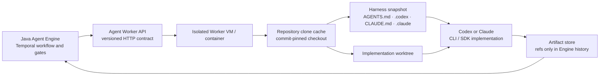

# Polyglot Agent Worker Design

> Status: Proposed — user-approved direction; implementation begins after this document review.

## 1. Goal

Run Codex and Claude from isolated Worker environments while keeping Java responsible only for the Temporal workflow, gates, retries, and durable state. Every Agent invocation must work from a registered remote repository, preserve the repository harness, and return versioned artifacts rather than provider-specific objects.

## 2. Decisions

| Decision | Chosen rule |
|---|---|
| Runtime isolation | A Worker container or VM owns clone, checkout, worktree, provider credentials, and agent process. Control Plane and Engine never execute an agent process. |
| Engine language | Java owns Temporal Workflows and calls a language-neutral Agent Worker HTTP contract. |
| Worker languages | TypeScript and Python are first-class Worker implementations. Java has CLI implementations only. |
| Providers | `codex` and `claude` are the first provider IDs. New providers add a Worker implementation, not Engine branching. |
| Transports | CLI: Java, Python, TypeScript. SDK: Python, TypeScript. |
| Session continuity | Provider thread/session IDs are optional opaque execution metadata. Artifact and harness snapshots are the authoritative cross-stage context. |
| Context source | Repository harness files plus generated, immutable stage-context documents inside the Worker workspace. |
| External protocol | Versioned JSON over HTTP. Do not put SDK classes, local paths, secret values, or provider-specific request shapes in `contracts`. |

## 3. Execution model

One execution is submitted with an idempotency key (`workflowRunId + stage + attempt`). The Worker returns `202 Accepted` with an execution ID, persists ordered events and artifact references, and exposes status/cancel/event reads. A Temporal Activity polls the execution with heartbeats. A retry therefore observes the same execution ID rather than starting a second agent process.

The Worker execution ledger and ordered event cursor are durable Worker-owned state; an in-memory event store is not sufficient because a Worker restart must preserve idempotency and status reads.

The Engine must not share a Temporal Activity task queue directly with multiple language implementations. HTTP makes the language boundary explicit and avoids cross-SDK payload and activity-name compatibility problems.

### 3.1 Contract migration

The current `engine.application.contract.v1` and `EngineActivities` remain the internal Java/Temporal workflow contract during migration. Their existing `WorkspaceRef` is intended to be opaque, but the reference implementation currently passes a literal local path to local workspace and source-control code. That v1 path coupling is **not** exported to an Agent Worker.

The new HTTP schema is `agent-worker/v1`, not a reinterpretation of the existing Java records. An Engine-side adapter maps only the four AI stages (`ASSESSMENT`, `PLANNING`, `IMPLEMENTATION`, `QA`) to the Worker API. `prepareWorkspace`, source control, and notifications remain on the existing Engine path until their own remote-Worker migrations are complete. No external Worker is allowed to poll the existing `EngineActivities` Task Queue.

Before the first remote execution, Control Plane supplies a non-secret `ProjectExecutionSnapshot`: project ID, repository URI, base branch, credential reference, and requested source commit. The Worker resolves the credential reference locally; the credential value never crosses the HTTP contract. This replaces the reference implementation's hard-coded `main` branch and synthetic artifact references.

## 4. Provider and transport matrix

| Implementation ID | Provider | Transport | Runtime language | Planned capability |
|---|---|---|---|---|
| `codex-cli-java` | Codex | CLI | Java | assessment, planning, implementation, QA |
| `claude-cli-java` | Claude | CLI | Java | assessment, planning, implementation, QA |
| `codex-cli-python` | Codex | CLI | Python | assessment, planning, implementation, QA |
| `claude-cli-python` | Claude | CLI | Python | assessment, planning, implementation, QA |
| `codex-cli-typescript` | Codex | CLI | TypeScript | assessment, planning, implementation, QA |
| `claude-cli-typescript` | Claude | CLI | TypeScript | assessment, planning, implementation, QA |
| `codex-sdk-python` | Codex | SDK | Python | assessment, planning, implementation, QA |
| `claude-sdk-python` | Claude | SDK | Python | assessment, planning, implementation, QA |
| `codex-sdk-typescript` | Codex | SDK | TypeScript | assessment, planning, implementation, QA |
| `claude-sdk-typescript` | Claude | SDK | TypeScript | assessment, planning, implementation, QA |

All ten implementations conform to one contract. They are not implemented by copy-pasting an entire Worker service ten times: each language has one Worker host, shared CLI/SDK transport layers, and provider adapters. Provider-specific command/SDK options remain inside the adapter.

Each Worker host has two provider adapters (`codex`, `claude`) for a given transport.

`providerId + transportId + runtimeId` is selected by explicit configuration. There is no dynamic plugin discovery, classpath scanning, or marketplace in this scope.

## 5. Stage workspace and context rules

### 5.1 Read stages

`ASSESSMENT` and `PLANNING` run in a commit-pinned clone checkout with write access disabled. They can inspect repository files, test configuration, current branch, and harness files but cannot edit source code.

Inputs are:

- normalized ticket and raw specification;
- project repository URI, base branch, and resolved source commit;
- repository assessment artifact when planning;
- harness snapshot manifest.

Outputs are artifacts: refined specification, feasibility/estimate, implementation plan, success criteria, test plan, and requested branch classification.

### 5.2 Write stages

Only after an approved implementation plan does `WORKSPACE` create one worktree. `IMPLEMENTATION` receives that worktree with `workspace-write` permission. `QA` receives the same worktree; it may create reports and test output but cannot create another worktree. The source-control stage alone may create or merge a PR.

The Engine owns approval state. A Worker cannot bypass a gate by writing directly to the target branch.

### 5.3 Harness snapshot

At execution start the Worker records a manifest containing content hashes and relative paths of applicable repository instructions:

- `AGENTS.md` and nested `AGENTS.md` files;
- `.codex/config.toml`, skills, hooks, and project rules;
- `CLAUDE.md`, `.claude/settings.json`, skills, agents, and hooks;
- project-local `.agents/` shared instructions.

Only regular files below the resolved repository root are included. The snapshotter rejects symbolic links, path escapes, oversized files, and paths outside an explicit allowlist. It never evaluates a hook while snapshotting. Registered repositories are trusted inputs; untrusted repository onboarding requires a separate security design.

It creates generated documents under `.agentic/context/` in the clone/worktree:

- `run.md` — immutable run ID, repository commit, stage, selected adapter;
- `ticket.md` — normalized ticket and raw requirement reference;
- `assessment.md` — assessment artifact reference/content for later stages;
- `implementation-plan.md` — approved plan reference/content;
- `feedback.md` — gate rejection or revision feedback;
- `manifest.json` — harness hash list and artifact references.

Generated context files never use `AGENTS.md`, `CLAUDE.md`, or another instruction-discovery filename. The Worker writes them under `.agentic/context/`, adds that path to the worktree's Git exclusion, and rejects a final source commit containing generated runtime context. The adapter receives only a short stage prompt that directs it to these files. This avoids repeatedly injecting a huge prompt and makes provider changes safe. A provider session/thread ID can optimize continuation, but correctness must not depend on it: a new provider or a resumed Worker reconstructs context from the snapshot and artifacts.

## 6. Common Worker HTTP contract

The later `contracts` module defines JSON schemas, not Java classes. Proposed resources are:

| Method | Resource | Responsibility |
|---|---|---|
| `POST` | `/v1/executions` | Submit idempotent stage execution; returns `202` and `executionId`. |
| `GET` | `/v1/executions/{executionId}` | Read state, provider session reference, result, and terminal error code. |
| `GET` | `/v1/executions/{executionId}/events?after=` | Read ordered, resumable execution events. |
| `POST` | `/v1/executions/{executionId}:cancel` | Request cancellation. |
| `GET` | `/v1/capabilities` | Report supported provider/transport/runtime/stage combinations. |

The submission contains `contractVersion`, execution ID/idempotency key, workflow run ID, stage, attempt number, adapter ID, `ProjectExecutionSnapshot`, read/write mode, context manifest reference, opaque workspace reference when present, and artifact references. It never contains an API key, access token, local absolute path, or raw secret.

Terminal results contain only normalized data: status, artifact references, QA score/report reference when applicable, changed-files summary, optional opaque provider session reference, and retryable/non-retryable error code.

## 7. Adapter behavior

### CLI adapters

CLI adapters run the approved executable in the stage working directory with an argument array, timeout, environment allowlist, output-size limit, and process-tree cancellation. They parse structured output only (`--json`, `--output-format json`, or equivalent) and store raw provider logs as protected artifacts.

They do not use permissive flags such as `--dangerously-skip-permissions`. Read stages use read-only/plan policies. Write stages use a Worker-level filesystem sandbox limited to the assigned worktree plus provider-specific allowed-tool rules.

### SDK adapters

Codex SDK adapters own Codex thread IDs and streamed turn/item events. Claude SDK adapters own Claude session IDs and streamed SDK messages. Both map provider events into the Worker event schema.

SDK use has no separate token price. It still consumes the quota or API usage of the authenticated provider account, and long harness/context/tool outputs increase model input usage. Credentials are injected only into the isolated Worker process from a secret manager.

## 8. Security and operations

- One project execution has one non-shared worktree; a stale worktree is cleaned only after artifact upload and retention policy allow it.
- The Worker obtains Git credentials from `credentialRef`; credentials never enter the Engine history, HTTP response, provider prompt, or logs.
- Provider authentication is Worker-scoped: Codex API/access token and Claude API/enterprise credentials are separate secret references.
- Worker events redact command environment values, credential-like strings, and provider authorization headers before storage/streaming.
- Each Worker reports its adapter versions and capabilities. Engine selection fails before execution if the requested adapter is unavailable.
- Artifact access is authorized separately from workflow status reads.

## 9. Delivery slices

1. Define `agent-worker/v1` JSON schemas, `ProjectExecutionSnapshot`, and the Java Engine client port. Document the v1 Java-Activity-to-HTTP migration; add schema and forbidden-field contract tests.
2. Build the common TypeScript Worker host: durable execution ledger, clone/read checkout, safe harness manifest, artifact/event model, cancellation, and restart/idempotency tests.
3. Add `codex-cli-typescript` and `claude-cli-typescript`; prove read/write sandbox modes using fake executables and the common adapter conformance suite.
4. Add `codex-sdk-typescript` and `claude-sdk-typescript`; prove thread/session event mapping with SDK test doubles and the same conformance suite.
5. Build the Python Worker host against the same schemas; reuse the conformance fixtures without changing JSON shape.
6. Add four Python adapters: Codex CLI/SDK and Claude CLI/SDK.
7. Add a thin Java CLI Worker host and its two adapters; reuse the same conformance suite.
8. Replace `EngineActivitiesImpl` AI stubs one stage at a time through the Java Worker client, beginning with assessment then planning, implementation, and QA. Keep local workspace/SCM Activities until their explicit migration tasks.
9. Run a container-backed end-to-end flow: remote project → assessment gate → plan gate → one worktree → implementation/QA loop → review/merge gate.

Each slice has one responsibility, one commit, focused contract/integration tests, code-quality check, and review. The ten adapters are not allowed to change Engine Workflow code.

## 10. Verification criteria

- Every adapter passes the same provider-neutral conformance suite: request validation, idempotent duplicate submission, ordered resumable events, cancellation, terminal result normalization, and secret/path exclusion.
- A Worker restart during a running execution preserves execution ID, event cursor, and terminal result without launching a duplicate provider process.
- Harness snapshot tests reject a symlink, a path escape, an oversized file, and an attempted generated-context commit.
- Read-stage tests prove no source-file modification; implementation/QA tests prove one approved worktree is reused.
- Engine contract tests prove that no provider SDK type, local absolute path, or secret field crosses the Java HTTP client boundary.
- Each of the ten adapters has a fake-runtime test. Real provider smoke tests are opt-in and run only in isolated environments with explicit credentials.

## 11. Out of scope

- Direct model API agent loops;
- remote TUI/PTTY control;
- dynamic plugin installation/discovery;
- a ticket synchronization adapter;
- multi-provider execution inside a single stage;
- a provider session as the only source of context.
